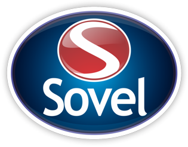

<!-- ====================== -->
<!-- README - GRUPO SOVEL -->
<!-- ====================== -->

  

  <h1 style="color:#00eaff; text-shadow:0 0 20px #00eaff;">
    ⚙️ Sistema de Gestão de Ferramentais ⚙️
  </h1>

  

    <b>Departamento de Amostras e Clicheria</b> 
    <b>Grupo Sovel da Amazônia</b>
  

  

    
    
    
    
  

  

    

  

  

  <h2 style="color:#00bfff; text-shadow:0 0 15px #00eaff;">💡 Sobre o Projeto</h2>

  

    O <b>Sistema de Gestão de Ferramentais</b> tem como propósito <b>automatizar e digitalizar</b> o controle de ferramentais do <b>Departamento de Amostras e Clicheria</b>.  
    Através de uma interface moderna e integração com <b>QR Codes</b>, o sistema gerencia <b>todo o ciclo de vida das ferramentas</b>, desde o recebimento até a substituição.
  

  

    🔹 Cada ferramenta possui um <b>QR Code exclusivo</b> contendo informações técnicas e rastreáveis. 
    🔹 Foco em <b>eficiência, agilidade e segurança operacional</b>. 
    🔹 Desenvolvido com base em <b>inovação tecnológica e melhoria contínua</b>.
  

  

  <h2 style="color:#00bfff;">🏢 Grupo Sovel da Amazônia</h2>
  
<b>Departamento de Amostras e Clicheria</b>

  

  <h2 style="color:#00bfff;">👥 Equipe D.A.C</h2>

  <table style="width:70%; border-collapse:collapse; text-align:center; margin:auto;">
    <tr style="background-color:#112240;">
      <th style="padding:10px; color:#00eaff;">Nome</th>
      <th style="padding:10px; color:#00eaff;">Cargo</th>
    </tr>
    <tr><td>Samueldson Ferreira</td><td>Supervisor</td></tr>
    <tr><td>Rafaelly Azevedo</td><td>Analista</td></tr>
    <tr><td>Elienson Duarte</td><td>Assistente</td></tr>
    <tr><td>Gustavo Albuquerque</td><td>Assistente</td></tr>
    <tr><td>Vanessa Nascimento</td><td>Assistente</td></tr>
  </table>

  

  <h2 style="color:#00bfff;">🛠️ Tecnologias e Recursos</h2>

  <pre style="background-color:#0d1b2a; color:#00eaff; padding:20px; border-radius:10px; box-shadow:0 0 20px #00eaff22; text-align:left;">
- Interface responsiva (HTML5/CSS3)
- Controle de ferramentais via QR Code
- Painel interativo e intuitivo
- Relatórios e histórico de movimentações
- Base pronta para integração com banco de dados interno
  </pre>

  

  <h2 style="color:#00bfff;">💬 Contato e Sugestões</h2>
  

    Envie suas ideias e melhorias diretamente para o <b>Departamento de Amostras e Clicheria</b>.  
    📧 <a href="mailto:dac@sovel.com.br" style="color:#00eaff;">dac@sovel.com.br</a> 
    📍 Manaus - AM, Brasil
  

  

  

    “Eficiência e inovação caminham lado a lado quando trabalhamos com propósito.”
  

  
<b>— Equipe D.A.C | Grupo Sovel da Amazônia</b>

  © 2025 Grupo Sovel da Amazônia • Departamento de Amostras e Clicheria

